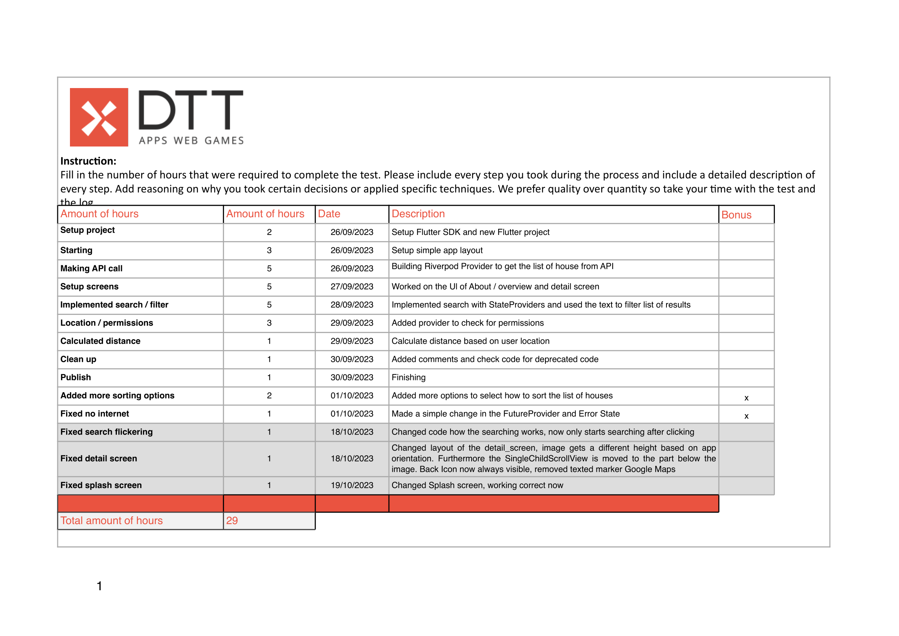

# flutter DTT Real Estate App
Flutter DTT real estate assessment project


- Android SDK target 34
- iOS target version 15.x

Do not forget to add the API keys to fully use the app

## Adding API keys
This project requires 2 API key:
- Key for DTT endpoint
- Key for Google Maps SDK Android / iOS

### API key DTT endpoint
Add this API key as additional agrument to `flutter run` \
`--dart-define="<API_KEY=YOUR_KEY_HERE>"`

### API key Google Maps SDK
#### Android
Add the API key to the `local.properties` file in the `android` folder of the project \
`MAPS_API_KEY=<YOUR_API_KEY_HERE>`

#### iOS
Add the API key to a new file called `keys.plist` file in the `/ios/Runner` folder of the project
```xml
<?xml version="1.0" encoding="UTF-8"?>
<!DOCTYPE plist PUBLIC "-//Apple//DTD PLIST 1.0//EN" "http://www.apple.com/DTDs/PropertyList-1.0.dtd">
<plist version="1.0">
<dict>
	<key>GOOGLE_MAPS_API_KEY</key>
	<string>YOUR_API_KEY_HERE</string>
</plist>
```

## Screenshots

<p float="center">
	
	 
	
	
</p>

# Hour Log

<p float="left">
	
</p>


